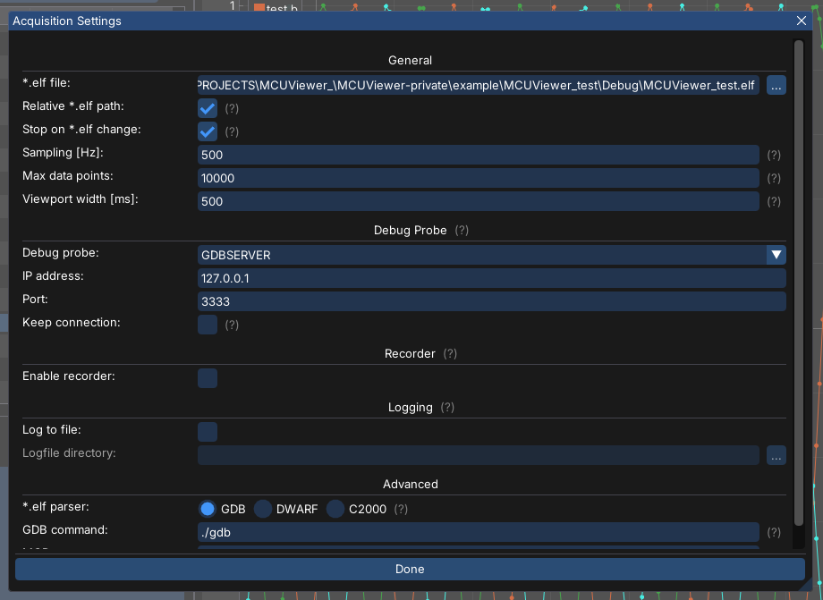
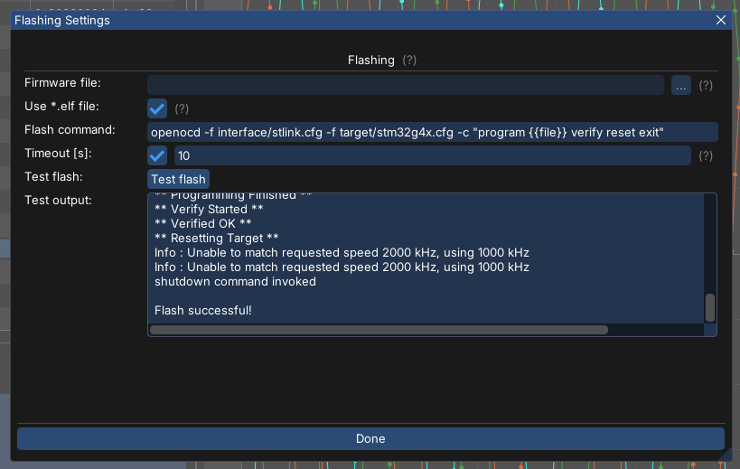

(STM32OpenOCDExample)=
# STM32 and OpenOCD

This short tutorial will present the openOCD connection to STM32 targets in MCUViewer. 

## Hardware setup

Only the debug probe (STLink) and the STM32 target are required. 

## Software

[OpenOCD](https://openocd.org/pages/getting-openocd.html) should be installed on your PC - please check beforehand by typing the "openocd" command in the terminal. The output should be similar to the one below: 

```
PS C:\Users\> openocd
xPack Open On-Chip Debugger 0.12.0+dev-01850-geb6f2745b-dirty (2025-02-07-10:08)
Licensed under GNU GPL v2
For bug reports, read
        http://openocd.org/doc/doxygen/bugs.html
```

## Modifying the *.cfg file 

Before we connect to the target, we have to ensure OpenOCD will not halt our target on connection. To do that we have to edit the target *.cfg file which is usually under the openocd install directory in "openocd\scripts\target". There you just have to locate your target's config file and insert the following commands at the end of the file: 

```
$_TARGETNAME configure -event gdb-attach { resume }
gdb memory_map disable
```

after that you can easily start the session using:

```
openocd -c "gdb_port 3333" -f interface/stlink.cfg -f target/stm32g4x.cfg -c "adapter speed 20000"
```
And move on to the MCUViewer. Make sure the session is running in the background. 

```{note}
Copying the openOCD config file to your project and only modifying the copy is recommended, so the openOCD template files stay untouched. In such case the command has to be modified to match the target config.
```

## MCUViewer setup

In MCUViewer the only thing you have to do is switch to GDBSERVER as debug probe in the Acquisition settings: 



After that the MCUViewer should connect to the existing openOCD session and display the variables added to the plot: 


## Flashing the firmware

We can easily set up the flashing command for the button on the main panel, so that after a firmware change the firmware download can be triggered directly from MCUViewer. To do that please select the Options->Flashing and set it as follows: 



The command used in this example is:

```
openocd -f interface/stlink.cfg -f target/stm32g4x.cfg -c "program {{file}} verify reset exit" 
```

where {file} is just an internal macro, which MCUViewer autocompletes with the *.elf file selected for the project. 